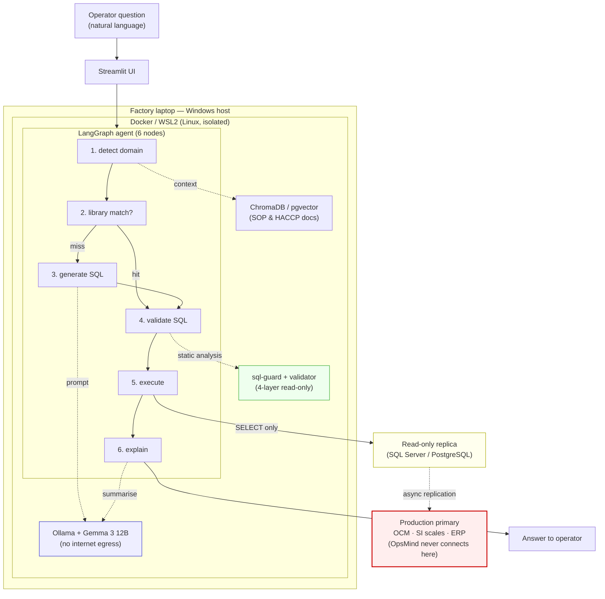
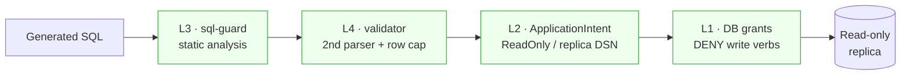

# OpsMind — architecture at a glance

A single-screen view of how an operator question becomes an answer,
fully on-premises. GitHub renders the Mermaid below; for the full
detail see [`architecture.md`](architecture.md) and the decision
records in [`adr/`](adr/).

## Query flow

## The four read-only layers

Any one layer alone blocks a write; a write would have to defeat all
four. L1 is enforced by the database engine, L2 by the connection
topology, L3 and L4 by OpsMind using two different parsers — so a
parsing gap in one cannot pass through the other. See
[ADR 0002](adr/0002-four-layer-read-only.md) for the reasoning.
